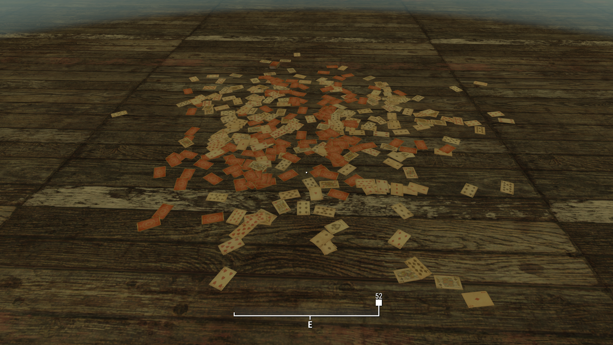

# Fallout 4 Games
Play classic games in Fallout 4.

Check out the [video playlist](https://www.youtube.com/playlist?list=PLdEgiq4kaju0r1Zw4MTMmxLbc9ZQ1MOLJ) for work in progress footage.

#### Features
- [x] Blackjack
- [ ] Slots
- [ ] Roulette
- [ ] Caravan
- [ ] Cadillac
- [ ] Spades

#### Requirements
* A computer, PC only.
* [F4SE](http://f4se.silverlock.org/)

#### Installation
* Start Fallout 4 with `Games.esm` enabled within your load order. 
* Enable `Games_WhiteCollar.esp` for classic games implemented in the vanilla game world.

#### Playing
Use the in-game developer console for access to the projects testing cell. Use the console command `coc GamesTestCell`. To add caps, use the console command `Player.AddItem F 100`. If `Games_WhiteCollar.esp` is enabled you may play games with certain NPCs or build game tables in settlements.

## Contributing
Please read [CONTRIBUTING.md](CONTRIBUTING.md) for details on contributing to this project.
To make a request, report a bug, or ask a question, submit an issue on the github [issue tracker](https://github.com/Scrivener07/FO4_Games/issues).

See also the list of [contributors](https://github.com/Scrivener07/FO4_Games/contributors) who participated in this project.

#### Acknowledgments
* [The White Collar Players](https://github.com/TheWhiteCollarPlayers) - Creator, contact on discord `TheWhiteCollarPlayers#7879`
* [Scrivener07](https://github.com/Scrivener07) - Scripter, contact on discord `Scrivener07#4154`
* [Se7enRaven](https://www.nexusmods.com/fallout4/users/184696) - Artist, created playing card assets as a resource for this project. See [LICENSE.RESOURCE.md](LICENSE.RESOURCE.md).
* [Expired](https://github.com/expired6978) - Programmer, added F4SE papyrus functions for scaleform interoperation.
* [Reg2K](https://github.com/reg2k) - Help, counsel regarding scaleform user interface and papyrus scripting.
* [Neanka](https://github.com/Neanka) - Help, counsel regarding scaleform user interface and papyrus scripting.
* [shad0wshayd3](https://github.com/shad0wshayd3) - Help, counsel regarding papyrus scripting.
* [ForsakenShell, E, 1000101](https://github.com/ForsakenShell) - Help, counsel regarding papyrus scripting.
* [Sireyn](https://www.nexusmods.com/users/4344629) - Tester, provided excellent feedback and reported critical bugs.
* **Sarinia** - Help, counsel regarding meshes, textures, and materials.
* **Jonathan Ostrus** - Help, counsel regarding settlement objects in the Creation Kit and papyrus scripting.
* **Kinggath** - Help, counsel regarding scripting for adding game tables to settlements.
* **Spooknik** - Help, counsel regarding creation of custom material swaps.
* **Gilles, Sagittarius** - This project was inspired by Sagittarius's [Tavern Games - Mini Games in Skyrim](https://www.nexusmods.com/skyrim/mods/68553/). Sagittarius has also provided support and feedback during development.
* **shavkacagarikia** - Help, counsel regarding papyrus scripting.

## License
This project is licensed under the permissive MIT License.
See the [LICENSE.md](LICENSE.md) file for details.

Please respect the license for each resource or asset used by this project.
