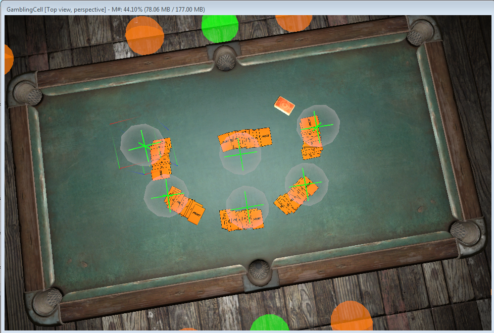

# Fallout 4 Gambling
Play classic games of chance or skill in Fallout 4.

At the current stage, this mod allows the player to visit a casino and gamble at a Blackjack table. 
The casino can be found in a previously unused building across the street from the Goodneighbor entrance.
The player will have to pass either a Strength, Charisma, or credit check to be allowed inside. 
Once inside, the basement of the casino contains the Blackjack table, with it's own dealer.

### Features and Enchancments 
- [ ] [Black Jack](https://github.com/Scrivener07/FO4_Gambling/issues/13)
- - [x] [Compete against opponent AI players](https://github.com/Scrivener07/FO4_Gambling/issues/9).
- - [ ] [Wager a bet with caps or goods.](https://github.com/Scrivener07/FO4_Gambling/issues/6)
- - [ ] [Top-down presentation of a gaming table](https://github.com/Scrivener07/FO4_Gambling/issues/11)
- - [ ] [An in-game tutorial.](https://github.com/Scrivener07/FO4_Gambling/issues/15)
- [ ] [Casino](https://github.com/Scrivener07/FO4_Gambling/issues/1).
- - [ ] [An introductory quest.](https://github.com/Scrivener07/FO4_Gambling/issues/14)
- [ ] [Award perks for performing well at games.](https://github.com/Scrivener07/FO4_Gambling/issues/2)

### Progress
Check out the [video playlist](https://www.youtube.com/playlist?list=PLdEgiq4kaju0r1Zw4MTMmxLbc9ZQ1MOLJ) for work in progress footage.

## Contributing
Please read [CONTRIBUTING.md](CONTRIBUTING.md) for details on our code of conduct, and the process for submitting pull requests to us.
To request a new [feature](https://github.com/Scrivener07/FO4_Gambling/issues?q=is%3Aissue+is%3Aopen+label%3Afeature) or [enchancment](https://github.com/Scrivener07/FO4_Gambling/issues?q=is%3Aissue+is%3Aopen+label%3Aenhancement), report a [bug](https://github.com/Scrivener07/FO4_Gambling/issues?q=is%3Aissue+is%3Aopen+label%3Abug), or ask a [question](https://github.com/Scrivener07/FO4_Gambling/issues?q=is%3Aissue+is%3Aopen+label%3Aquestion), submit an issue on the tracker.

See also the list of [contributors](https://github.com/Scrivener07/FO4_Gambling/contributors) who participated in this project.

#### Acknowledgments
* [The White Collar Players](https://github.com/TheWhiteCollarPlayers) - Creator, contact on discord `TheWhiteCollarPlayers#7879`, [Youtube](https://www.youtube.com/channel/UCeJRP8IO7xhceM_xXrKxOcg), or [Email](mailto:twcpgaming@gmail.com)
* [Scrivener07](https://github.com/Scrivener07) - Scripter, contact on discord `Scrivener07#4154`
* Se7enRaven - Artist, created [playing card assets](http://www.nexusmods.com/fallout4/mods/23990/?) as a resource for this project.
* Sarinia - Help, counsel regarding meshes, textures, and materials.

## License
This project is licensed under the MIT License - see the [LICENSE.md](LICENSE.md) file for details.
